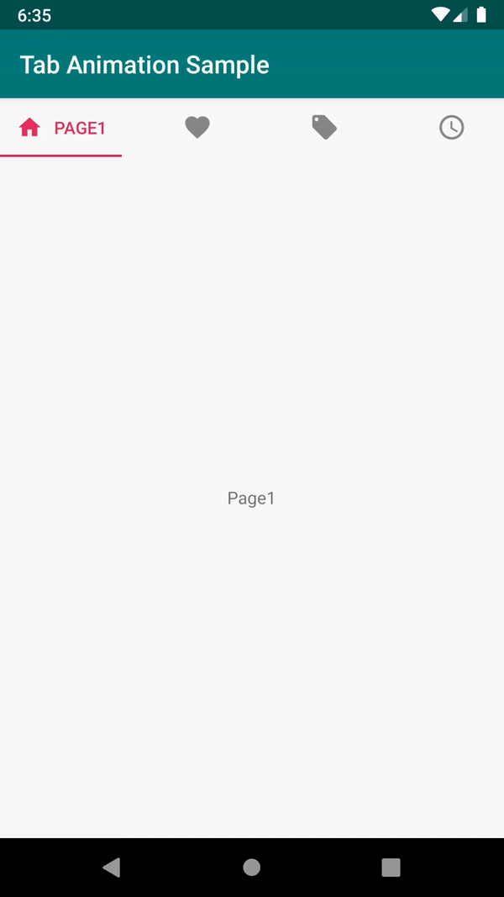

# Tab Animation

[](https://opensource.org/licenses/Apache-2.0)

Easily create `TabLayout.Tab` animations that sync with the scrolling progress of `ViewPager`.

## Features

- Animate Tab when scrolling ViewPager
- Animate Tab after selected/unselected
- Support ViewPager and ViewPager2
- Create animations with DSL

## Demo



## Usage

### Gradle

```gradle
implementation 'jp.co.cyberagent.android.tab-animation:x.y.z'

```

### Step 1

Create animation info for Tab:

```kotlin
val animationInfo = viewIdAnimationInfo {
  animateText<Float> {
    property(View.SCALE_X)
    startValue(0.8f)
    endValue(1f)
  }
  animateText<Float> {
    property(View.SCALE_Y)
    startValue(0.8f)
    endValue(1f)
  }
}
```

### Step 2

Link the TabLayout, ViewPager and animation info:

```kotlin
// TabLayout extension function
tabLayout.setupAnimationTabWithViewPager(
  viewPager,
  animationInfo,
  SimpleTab.TEXT
)
```

## Advanced Usage

### Custom tab view

Provide the layout file id instead of SimpleTab:

```kotlin
tabLayout.setupAnimationTabWithViewPager(
  viewPager,
  animationInfo,
  R.layout.my_custom_tab
) { tab, view, position ->
  // bind data here
}
```

### Custom animate target

Specify the target id in viewIdAnimationInfo:

```kotlin
viewIdAnimationInfo {
  animate<MyView, Float>(R.id.my_view) {
    ...
  }
}
```

### Custom property

```kotlin
// Create tint property
animateIcon<ColorStateList> {
  property(
    getter = { ImageViewCompat.getImageTintList(this)!! },
    setter = { ImageViewCompat.setImageTintList(this, it) }
  )
  ...
}
```

### Custom evaluator

Current support property types:
- Int (ARGB)
- Float
- IntArray
- FloatArray
- PointF
- Rect
- ColorStateList

You must specify the evaluator if the property type you want to animate is not listed:

```kotlin
animate<MyView, MyType> {
  evaluator(MyEvaluator)
  ...
}
```

### Specify KeyFrames

```kotlin
animateText<Float> {
  property(View.ALPHA)
  startValue(0f)
  endValue(1f)
  keyFrame(0.8f, 0.2f)
}
```

### Lazy value

Animation info will be evaluated after the layout of Tab.
You can calculate the value based on the view:

```kotlin
animateIcon<Float> {
  property(View.TRANSLATION_X)
  startValue { view ->
    view.width / 2f
  }
  endValue { 0f }
}
```

## License

    Copyright 2019 CyberAgent, Inc.

    Licensed under the Apache License, Version 2.0 (the "License");
    you may not use this file except in compliance with the License.
    You may obtain a copy of the License at

       http://www.apache.org/licenses/LICENSE-2.0

    Unless required by applicable law or agreed to in writing, software
    distributed under the License is distributed on an "AS IS" BASIS,
    WITHOUT WARRANTIES OR CONDITIONS OF ANY KIND, either express or implied.
    See the License for the specific language governing permissions and
    limitations under the License.
